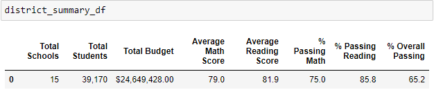
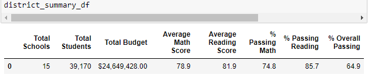
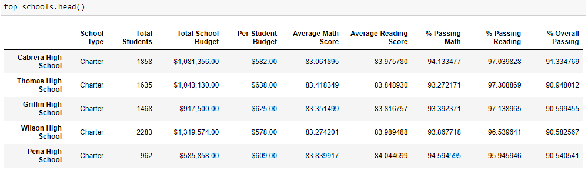
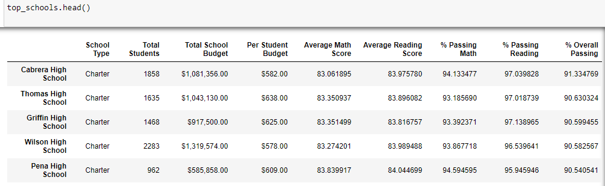
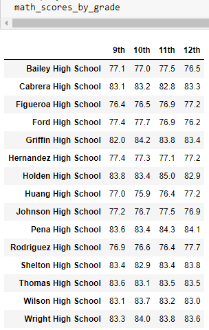
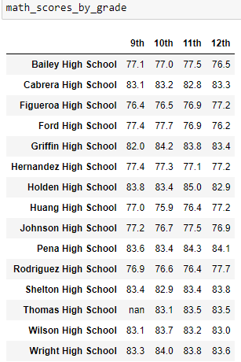

# School District Analysis
## Analysis Overview
The chief data scientist for a city school district is in charge of preparing all standardized test data for analysis, reporting, and presentation to provide insights about performance trends and patterns. I have been provided data on student funding and student standardized test scores, and been tasked with aggregating the data and showcasing trends in performance using Python and Jupyter Notebook. 
### Purpose
After initially compiling and analyzing the [original school district data](PyCitySchools.ipynb), it was discovered that an unknown amount of academic dishonesty had occurred within Thomas High School's 9th grade math and reading scores. Therefore, both the district and school data had to be adjusted to disregard these scores with a minimum impact to the rest of the data. The Thomas High School's 9th grade math and reading scores were replaced with `NaN` values, and the affected students were removed from the total student count to recalculate the various test score averages. This provided the [adjusted school district data](PyCitySchools_Challenge.ipynb) from which we can draw more accurate insights.
## Results
- **How is the district summary affected?**
  - While the district totals were not changed, all of the score averages and passing percentages showed a slight decrease, except for the Average Reading Score, which remained the same.
  - Original scores: 
  - Adjusted scores: \
- **How is the school summary affected?**
  - As can be seen in the images below, adjusting the scores for 9th grade caused Thomas High School's average math score to decrease slightly and the average reading score to increase slightly. Also, the percentage of student's passing math, reading, and overall all decreased slightly.
- **How does replacing the ninth graders' math and reading scores affect Thomas High School's performance relative to the other schools?**
  - Although Thomas High School's overall passing percentage did decrease, it was not enough to change its position as the second highest performing school in the district.
  - Original top 5 schools: 
  - Adjusted top 5 schools: 
- **How does replacing the ninth-grade scores affect the following:**
  - *Math and reading scores by grade*
    - Replacing the ninth-grade scores with `NaN` only replaced the ninth-grade average scores for Thomas High School with `NaN` and had no effect on any other scores.
    - Original Math Scores by Grade: 
    - Adjusted Math Scores by Grade: 
  - *Scores by school spending*
    - There was no visible change in the scores per school spending.
  - *Scores by school size*
    - There was no visible change in the scores by school size.
  - *Scores by school type*
    - There was no visible change in the scores by school type.
## Summary
After the reading and math scores for the ninth grade at Thomas High School were replaced with `NaN`, there were changes throughout the analysis with the majority of the changes being decreases in score averages and percentages. The school district passing percentages all decreased and the average math score decreased. Within the school summary of Thomas High School, the passing percentages all decreased, including the overall passing percentage. This nearly lowered the schools standing in the top 5 performing schools of the district. While the average math scores of Thomas High School decreased, the average reading scores actually increased. Overall, changing the ninth-grade scores at Thomas High School did not have a drastic impact on the overall data. This can be largely attributed to the ninth-grade reading and math score averages being very similar to the score averages of the other Thomas High School grade averages. The average math scores for the ninth to twelfth-grade were, in order: 83.6, 83.1, 83.5, 83.5. All four averages were within 0.5 points of each other, and the ninth-grade average was the highest. Therefore, removing the ninth-grade score would cause a slight decrease in the school average, but would not drastically affect the school or district averages. Similarly, the average reading scores for the grades were: 83.7, 84.3, 83.6, 83.8. In this case, the scores are within 0.7 points of each other, but the ninth-grade score is actually the second-lowest score, so when it is removes, the school average increased slightly.

